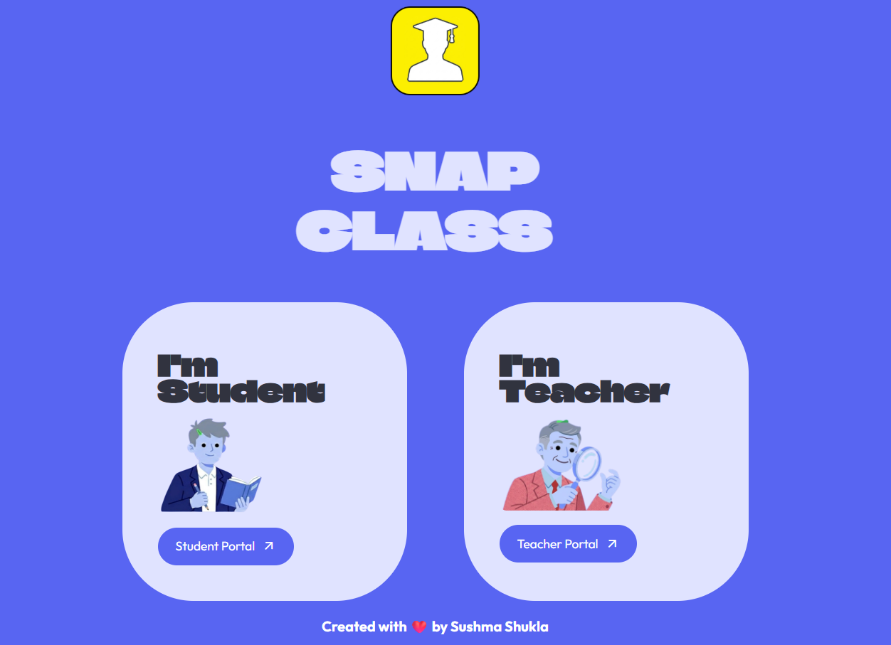

# SnapClass — Landing Page

> Marketing landing page for [SnapClass](https://snapclass.streamlit.app/), an AI-powered attendance system built with computer vision and voice biometrics.



---

## 🔗 Live Links

| | Link |
|---|---|
| 🌐 Landing Page | Deployed on Vercel |
| 🤖 Main App | [attendance-snap-ai.streamlit.app](https://attendance-snap-ai.streamlit.app/) |

---

## 📁 Project Structure

```
ai-attendance-project-landing/
├── app.py                  # Flask app entry point
├── requirements.txt        # Python dependencies
├── vercel.json             # Vercel deployment config
├── templates/
│   └── index.html          # Main landing page
└── static/
    ├── css/
    │   └── style.css       # All page styles
    ├── js/
    │   └── script.js       # JS interactions
    ├── fonts/
    │   └── chison.ttf      # Custom font
    └── img/
        ├── logo.png
        ├── app_logo.png
        └── demo/           # UI screenshots used in page
```

---

## ✨ What This Page Covers

### Features Showcased
- **AI Face Analysis** — Face recognition from classroom photos using dlib & FaceRecognition
- **Sequential Voice ID** — Voice biometrics via Resemblyzer & Librosa
- **QR-Driven Roster** — QR code based student enrollment

### Teacher's Journey (6 Steps)
1. Secure Login
2. Interactive Dashboard
3. Course Management
4. FaceID Attendance
5. Voice ID Attendance
6. Actionable Records

### Student's Journey (3 Phases)
1. Instant Enrollment via QR
2. Biometric Registration (Face + Voice)
3. Personal Attendance Dashboard

### Tech Stack Highlighted
- **Streamlit** — Reactive frontend for the main app
- **Flask** — Landing page server
- **dlib + FaceRecognition** — Facial biometrics
- **Resemblyzer + Librosa** — Voice biometrics
- **Supabase** — PostgreSQL database with real-time sync

---

## 🚀 Run Locally

### Prerequisites
- Python 3.8+

### Setup

```bash
# Clone the repo
git clone https://github.com/your-username/ai-attendance-project-landing.git
cd ai-attendance-project-landing

# Install dependencies
pip install -r requirements.txt

# Run the app
python app.py
```

App will start at `http://localhost:5002`

> **Note:** The main AI attendance app runs separately on Streamlit Cloud: [attendance-snap-ai.streamlit.app](https://attendance-snap-ai.streamlit.app/)

---

## ☁️ Deploy on Vercel

This project is pre-configured for Vercel deployment via `vercel.json`.

```bash
# Install Vercel CLI
npm i -g vercel

# Deploy
vercel
```

The `vercel.json` routes all traffic through `app.py` using the `@vercel/python` builder.

---

## 🛠️ Tech Stack

| Technology | Purpose |
|---|---|
| Flask | Web server |
| Gunicorn | Production WSGI server |
| HTML/CSS/JS | Frontend |
| Vercel | Hosting & deployment |

---

## 🔗 Related Repository

Main SnapClass app (Streamlit + AI): [AI-Attendance-System](https://github.com/your-username/AI-Attendance-System)

---

*Built with ❤️ by Sushma Shukla*
